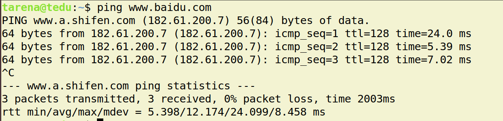
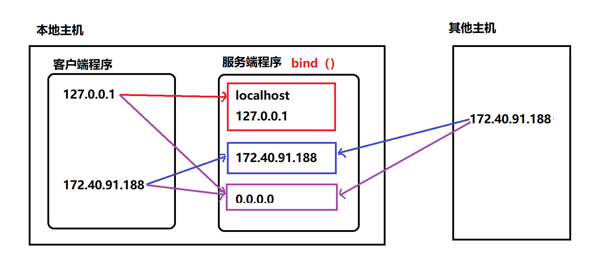
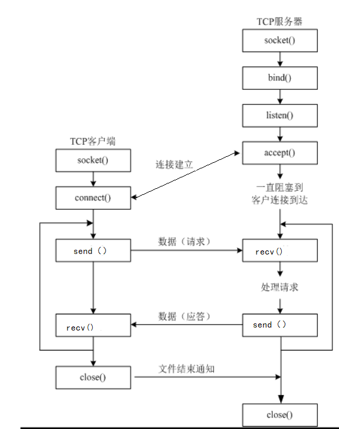
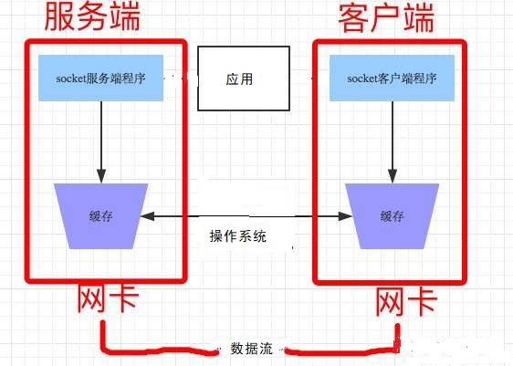
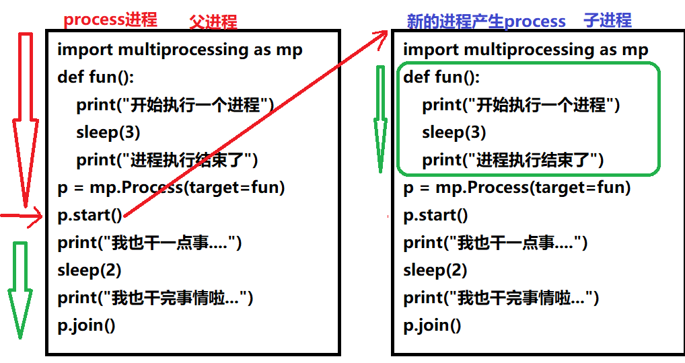
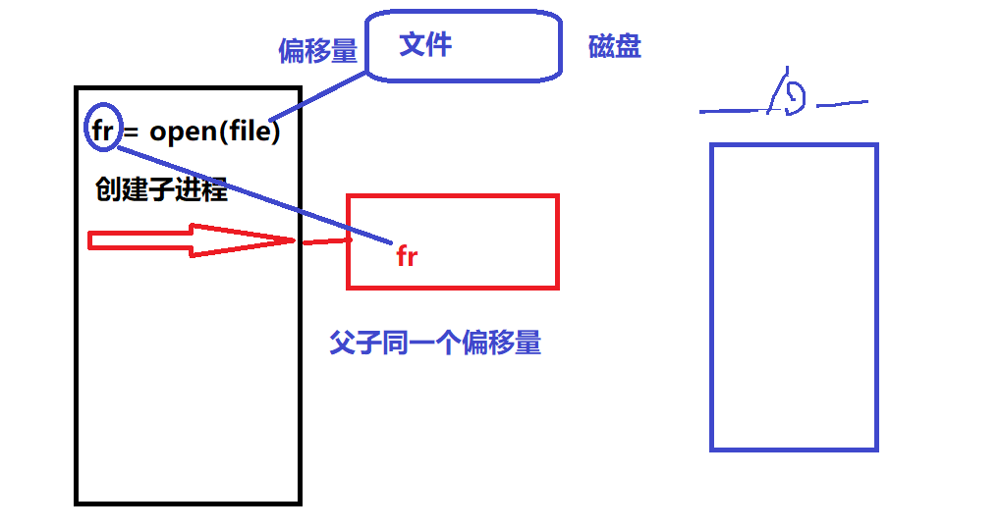
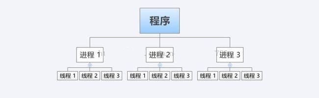
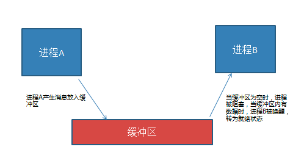
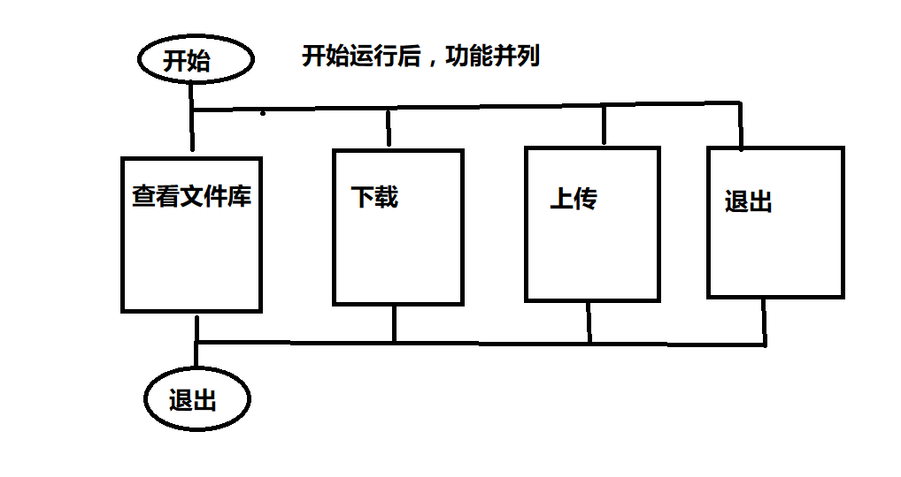
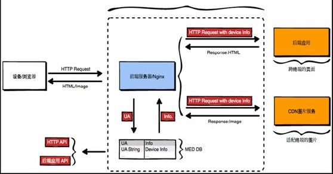

并发网络编程
==========================

| Tedu Python 教学部 |
| --- |
| Author：吕泽|

-----------

[TOC]

## 1. 网络编程

### 1.1 网络基础知识


#### 1.1.1 什么是网络

* 什么是网络 : 计算机网络功能主要包括实现资源共享，实现数据信息的快速传递。

  

  

#### 1.1.2 网络通信标准

* 面临问题

  1. 不同的国家和公司都建立自己的通信标准不利于网络互连
  2. 多种标准并行情况下不利于技术的发展融合

  


* OSI 7层模型

  

  * 好处

    1. 建立了统一的通信标准

    2. 降低开发难度，每层功能明确，各司其职

    3. 七层模型实际规定了每一层的任务，该完成什么事情

    理论问题面试回答：这是什么，具体描述，它的好处，引申扩展，我用它做了什么
    
    一个面试回答正确60%-70%左右可，
    
    它是一个标准的网络通信模型，

* TCP/IP模型

  * 七层模型过于理想，结构细节太复杂
  * 在工程中应用实践难度大
  * 实际工作中以TCP/IP模型为工作标准流程

  
         

* 网络协议

  * 什\么是网络协议：在网络数据传输中，都遵循的执行规则。

  * 网络协议实际上规定了每一层在完成自己的任务时应该遵循什么规范。


* 需要应用工程师做的工作 ： 编写应用工功能，明确对方地址，选择传输服务。

    

#### 1.1.3  通信地址


* IP地址

  * IP地址 ： 即在网络中标识一台计算机的地址编号。

  * IP地址分类

    * IPv4 ： 192.168.1.5 
    * IPv6 ：fe80::80a:76cf:ab11:2d73

  * IPv4 特点

    * 分为4个部分，每部分是一个整数，取值分为0-255

  * IPv6 特点（了解）

    * 分为8个部分，每部分4个16进制数，如果出现连续的数字 0 则可以用 ：：省略中间的0

  * IP地址相关命令

    * ifconfig : 查看Linux系统下计算机的IP地址（两个冒号：省略中间零）

      

    * ping  [ip]：查看计算机的连通性 ,ctrl+c结束

      

  * 公网IP和内网IP

    * 公网IP指的是连接到互联网上的公共IP地址，大家都可以访问。（将来进公司，公司会申请公网IP作为网络项目的被访问地址）
    * 内网IP指的是一个局域网络范围内由网络设备分配的IP地址。

  拿一个家庭来举例，一般你的路由器以内，就是内网，并且路由器内连接的所有设备或终端都会被分配一个内网ip；反之，路由器及以外就是外网ip，这个外网ip通常在路由器的WAN口上。（内网IP可以重复，外网IP不可）

  

* 端口号

  * 端口：网络地址的一部分，在一台计算机上，每个网络程序对应一个端口。

  * 客户端端口 由操作系统随机分配端口，发给服务器，服务器端的为固定端口

    

  * 端口号特点
  
    * 取值范围： 0 —— 65535 的整数
    * 一台计算机上的网络应用所使用的端口不会重复
    * 通常 0——1023 的端口会被一些有名的程序或者系统服务占用，个人一般使用 > 1024的端口

#### 1.1.4 服务端与客户端

* 服务端（Server）：服务端是为客户端服务的，服务的内容诸如向客户端提供资源，保存客户端数据，处理客户端请求等。

* 客户端（Client） ：也称为用户端，是指与服务端相对应，为客户提供一定应用功能的程序，我们平时使用的手机或者电脑上的程序基本都是客户端程序。

  


### 1.2 UDP 传输方法

#### 1.2.1 套接字简介

* 套接字(Socket) ： 实现网络编程进行数据传输的一种技术手段,网络上各种各样的网络服务大多都是基于 Socket 来完成通信的。

  

* Python套接字编程模块：import  socket


#### 1.2.3  UDP套接字编程

* 创建套接字

```python
    sockfd=socket.socket(socket_family,socket_type,proto=0)
    功能：创建套接字
    参数：socket_family  网络地址类型  参数包含 AF_INET表示ipv4   
    										AF_INET6表示ipv6
         socket_type  套接字类型  参数包含 SOCK_DGRAM 表示udp套接字 （也叫数据报套接字）
             						    SOCK_STREAM 表示tcp套接字服务 
         proto  通常为0  选择子协议(应用层编程只包含udp,tcp，这俩都无子协议)
    返回值： 套接字对象 
```


* 绑定地址（一般服务端使用）
  * 本地地址 ： 'localhost' , '127.0.0.1'
  * 网络地址 ： '172.40.91.185' （通过ifconfig查看）
  * 自动获取地址： '0.0.0.0'



```python
    sockfd.bind(addr)
    功能： 绑定本机网络地址
    参数： 二元元组 (ip,port)  ('0.0.0.0',8888)
    IP选择有三种：网络IP地址 192.168.0.114   ifconfig查询IP
    			本地测试IP：127.0.0.1
        		自动匹配IP：0.0.0.0（意思是如果客户端在其他主机上访问用网络IP，客户端在本地主机上访问用127.0.0.1）
```

* 消息收发

```python		    
    data,addr = 对象sockfd.recvfrom(buffersize)
    功能： 接收UDP消息
    参数： 每次最多接收多少字节
    返回值： data  接收到的内容 bytes格式
            addr  消息发送方地址

    n = sockfd.sendto(data,addr)
    功能： 发送UDP消息
    参数： data  发送的内容 bytes格式
          addr  目标地址
    返回值：发送的字节数
```

* 关闭套接字

```python
    sockfd.close()
    功能：关闭套接字
```


* 服务端客户端流程

  

服务器端接收消息

```python
"""
udp 服务端模型

重点代码 ！！！
"""
from socket import *

# 生成udp套接字
udp_sock = socket(AF_INET,SOCK_DGRAM)

# 绑定地址
udp_sock.bind(("0.0.0.0",8888))

# 接收数据  recvfrom 阻塞等待
data,addr = udp_sock.recvfrom(1024)
print("接收到：",data.decode()) # data --> bytes

# 发送数据 发送字节串
n = udp_sock.sendto(b"Thanks",addr)
print("发送了%d bytes"%n)

# 关闭套接字
udp_sock.close()
```

客户端发送消息（客户端一般不绑定地址，端口由计算机随机分配）

```python
"""
udp 客户端演示

重点代码 ！！！
"""
from socket import *

# 服务端地址
ADDR = ("127.0.0.1",8888)

# 创建与服务端相同的套接字
udp_socket = socket(AF_INET,SOCK_DGRAM)

# 发送数据
data = input(">>")
udp_socket.sendto(data.encode(),ADDR)

# 接收
data,addr = udp_socket.recvfrom(1024)
print("从服务端收到:",data.decode())

udp_socket.close()
```

#### 1.2.4  UDP套接字特点

* 可能会出现数据丢失的情况(一次发送的数据如果没有接受完，没发过去的就丢失了)
* 传输过程简单，实现容易
* 数据以数据包形式表达传输
* 数据传输效率较高


### 1.3 TCP 传输方法


#### 1.3.1 TCP传输特点


* 面向连接的传输服务
  * 传输特征 ： 提供了可靠的数据传输，可靠性指数据传输过程中无丢失，无失序，无差错，无重复。
  * 可靠性保障机制（都是操作系统网络服务自动帮应用完成的）： 
    * 在通信前需要建立数据连接
    * 确认应答机制
    * 通信结束要正常断开连接

* 三次握手（建立连接）
  * 客户端向服务器发送消息报文请求连接
  * 服务器收到请求后，回复报文确定可以连接
  * 客户端收到回复，发送最终报文连接建立（表示正式建立起连接）


					


* 四次挥手（断开连接）
  * 主动方发送报文请求断开连接
  * 被动方收到请求后，立即回复，表示准备断开
  * 被动方准备就绪，再次发送报文表示可以断开,准备好了
  * 主动方收到确定，发送最终报文完成断开


#### 1.3.2 TCP服务端


- 创建套接字

```python
    sockfd=socket.socket(socket_family,socket_type,proto=0)
    功能：创建套接字
    参数：socket_family  网络地址类型 AF_INET表示ipv4
         socket_type  套接字类型 SOCK_STREAM 表示tcp套接字 （也叫流式套接字） 
         proto  通常为0  选择子协议
            三个参数不写默认为tcp
    返回值： 套接字对象
```

- 绑定地址 （与udp套接字相同）

客户端从来不绑定地址，只要连接不断开，地址不变

* 设置监听

```python
    sockfd.listen(n)
    功能 ： 将套接字设置为监听套接字，确定监听队列大小，确定能被客户端连接
    参数 ： 监听队列大小（Linux下的n默认为系统的参数，3不3都无所谓）
```


* 处理客户端连接请求

```python
    connfd,addr = sockfd.accept()
    功能： 阻塞等待处理客户端请求（谁连接我了，我就知道客户端地址了）
    返回值： connfd  客户端连接套接字，为每一个客户端生成一个新的套接字，专门为客户端服务
            addr  连接的客户端地址
```

* 消息收发

```python
    data = connfd.recv(buffersize)比udp少一个参数地址，一个连接套接字对应一个客户端，所以不需要地址
    功能 : 接受客户端消息
    参数 ：每次最多接收消息的大小
    返回值： 接收到的内容，

    n = connfd.send(data)
    功能 : 发送消息
    参数 ：要发送的内容  bytes格式
    返回值： 发送的字节数
```

6. 关闭套接字 (与udp套接字相同)


#### 1.3.3 TCP客户端 


* 创建TCP套接字
* 请求连接

```python
    sockfd.connect(server_addr)
    功能：连接服务器
    参数：元组  服务器地址
```

* 收发消息

> 注意： 防止两端都阻塞，recv send要配合

* 关闭套接字




两个循环模型

```python
"""
tcp 套接字循环模型 1
重点代码 ！！！
"""
from socket import *

# 创建tcp套接字
tcp_socket = socket(AF_INET,SOCK_STREAM)

# 绑定地址
tcp_socket.bind(("0.0.0.0",8888))

# 设置监听套接字
tcp_socket.listen(5)

# 循环等待处理客户端连接
while True:
    print("Waiting for connect...")
    connfd,addr = tcp_socket.accept()
    print("Connect from",addr)

    # 循环收发数据
    while True:
        data = connfd.recv(1024)
        # data 为空表示客户端close 断开
        if not data:
            break

        # 接收到## 表示客户端退出
        # if data == b"##":
        #     break
        print("Receive:",data.decode())
        connfd.send(b"Thanks")
    connfd.close()

# 关闭
tcp_socket.close()
```

```
"""
tcp 循环模型1 客户端
重点代码 ！！！
"""
from socket import *

# 服务端地址
ADDR = ("127.0.0.1",8888)

# 默认参数就是tcp
tcp_socket = socket()

# 连接服务端
tcp_socket.connect(ADDR)

# 循环数据收发
while True:
    data = input(">>")
    if not data:
        break
    tcp_socket.send(data.encode())

    # 如果输入## 则告知服务端，结束循环
    # if data == "##":
    #     break

    data = tcp_socket.recv(1024)
    print("From server:",data.decode())

tcp_socket.close()
```

循环模型2，每次循环建立连接

```python
"""
tcp 套接字循环模型 2
重点代码 ！！！
可以同时启动多个客户端
"""
from socket import *

# 创建tcp套接字
tcp_socket = socket(AF_INET,SOCK_STREAM)

# 绑定地址
tcp_socket.bind(("0.0.0.0",8888))

# 设置监听套接字
tcp_socket.listen(5)

# 循环等待处理客户端
while True:
    connfd,addr = tcp_socket.accept()

    data = connfd.recv(1024)
    print("Receive:",data.decode())
    connfd.send(b"Thanks")

    connfd.close()

# 关闭
tcp_socket.close()
```

```
"""
tcp 循环模型2 客户端
重点代码 ！！！
"""
from socket import *

# 服务端地址
ADDR = ("127.0.0.1",8888)


# 循环数据收发
while True:
    data = input(">>")
    if not data:
        break
    # 整个套接字创建连接操作都需要重新来
    tcp_socket = socket()
    tcp_socket.connect(ADDR)

    tcp_socket.send(data.encode())
    data = tcp_socket.recv(1024)
    print("From server:",data.decode())

    tcp_socket.close()
```

#### 1.3.4 TCP套接字细节

* tcp连接中当一端退出，（客户端退出，sever只等待专有的连接套接字发送消息），另一端如果阻塞在recv，此时因为断开连接，recv会立即返回一个空字串。（udp 不会，因为udp可以接收任意客户端的消息，一个客户端退出不会影响服务端）

  所以tcp传输，需要双方都退出才能正常退出

  

  那么客户端断开后，如何才能让服务端继续连接下一个客户端？

  见tcp_model/tcp_sever_loop_fin

  那么如何可以让多个客户端同时连接服务端呢，上一个客户端无需退出？

  循环，三次握手和四次挥手都在循环中见server2

* tcp连接中如果一端已经不存在，仍然试图通过send向其发送数据则会产生BrokenPipeError

* 一个服务端可以同时连接多个客户端，也能够重复被连接

* tcp粘包问题（一次性的接受了对方多个消息）

  * 产生原因

    * 为了解决数据再传输过程中可能产生的速度不协调问题，操作系统设置了缓冲区
    * 实际网络工作过程比较复杂，导致消息收发速度不一致
    * tcp以字节流方式进行数据传输，在接收时不区分消息边界(udp有消息边界)

    

  * 带来的影响

    * 如果每次发送内容是一个独立的含义，需要接收端独立解析此时粘包会有影响。

  * 处理方法

    * 人为的添加消息边界，用作消息之间的分割
    * 控制发送的速度


#### 1.3.5 TCP与UDP对比（面试）

* 传输特征
  * TCP提供可靠的数据传输，但是UDP则不保证传输的可靠性
  * TCP传输数据处理为字节流，而UDP处理为数据包形式
  * TCP传输需要建立连接才能进行数据传，效率相对较低，UDP比较自由，无需连接，效率较高

* 套接字编程区别
  * 创建的套接字类型不同
  * tcp套接字会有粘包，udp套接字有消息边界不会粘包
  * tcp套接字依赖listen accept建立连接才能收发消息，udp套接字则不需要
  * tcp套接字使用send，recv收发消息，udp套接字使用sendto，recvfrom
* 使用场景
  * tcp更适合对准确性要求高，传输数据较大的场景
    * 文件传输：如下载电影，访问网页，上传照片
    * 邮件收发
    * 点对点数据传输：如点对点聊天，登录请求，远程访问，发红包
  * udp更适合对可靠性要求没有那么高，传输方式比较自由的场景
    * 视频流的传输： 如直播，视频聊天
    * 广播：如网络广播，群发消息
    * 实时传输：如游戏画面
  * 在一个大型的项目中，可能既涉及到TCP网络又有UDP网络


### 1.4 数据传输过程


#### 1.4.1 传输流程

* 发送端由应用程序发送消息，逐层添加首部信息，最终在物理层发送消息包。
* 发送的消息经过多个节点（交换机，路由器）传输，最终到达目标主机。
* 目标主机由物理层逐层解析首部消息包，最终到应用程序呈现消息。


#### 1.4.2 TCP协议首部（了解）


* 源端口和目的端口 各占2个字节，分别写入源端口和目的端口。

* 序号 占4字节。TCP是面向字节流的。在一个TCP连接中传送的字节流中的每一个字节都按顺序编号。例如，一报文段的序号是301，而接待的数据共有100字节。这就表明本报文段的数据的第一个字节的序号是301，最后一个字节的序号是400。

* 确认号 占4字节，是期望收到对方下一个报文段的第一个数据字节的序号。例如，B正确收到了A发送过来的一个报文段，其序号字段值是501，而数据长度是200字节（序号501~700），这表明B正确收到了A发送的到序号700为止的数据。因此，B期望收到A的下一个数据序号是701，于是B在发送给A的确认报文段中把确认号置为701。

* 确认ACK（ACKnowledgment） 仅当ACK = 1时确认号字段才有效，当ACK = 0时确认号无效。TCP规定，在连接建立后所有的传送的报文段都必须把ACK置为1。

* 同步SYN（SYNchronization） 在连接建立时用来同步序号。当SYN=1而ACK=0时，表明这是一个连接请求报文段。对方若同意建立连接，则应在响应的报文段中使SYN=1和ACK=1，因此SYN置为1就表示这是一个连接请求或连接接受报文。

* 终止FIN（FINis，意思是“完”“终”） 用来释放一个连接。当FIN=1时，表明此报文段的发送发的数据已发送完毕，并要求释放运输连接。


## 2. 多任务编程

### 2.1 多任务概述

* 多任务

   即操作系统中可以同时运行多个任务。比如我们可以同时挂着qq，听音乐，同时上网浏览网页。这是我们看得到的任务，在系统中还有很多系统任务在执行,现在的操作系统基本都是多任务操作系统，具备运行多任务的能力。

  

  

  


* 计算机原理 

  * CPU：计算机硬件的核心部件，用于对任务进行执行运算。

    

  * 操作系统调用CPU执行任务

    

  * cpu轮训机制 ： cpu都在多个任务之间快速的切换执行，切换速度在微秒级别，其实cpu同时只执行一个任务，但是因为切换太快了，从应用层看好像所有任务同时在执行。

    

  * 多核CPU：现在的计算机一般都是多核CPU，比如四核，八核，我们可以理解为由多个单核CPU的集合。这时候在执行任务时就有了选择，可以将多个任务分配给某一个cpu核心，也可以将多个任务分配给多个cpu核心，操作系统会自动根据任务的复杂程度选择最优的分配方案。

    * 并发 ： 多个任务如果被分配给了一个cpu内核，那么这多个任务之间就是并发关系，并发关系的多个任务之间并不是真正的‘"同时"。
    * 并行 ： 多个任务如果被分配给了不同的cpu内核，那么这多个任务之间执行时就是并行关系，并行关系的多个任务时真正的“同时”执行。

  

* 什么是多任务编程

  多任务编程即一个程序中编写多个任务，在程序运行时让这多个任务一起运行，而不是一个一个的顺次执行。

  比如微信视频聊天，这时候在微信运行过程中既用到了视频任务也用到了音频任务，甚至同时还能发消息。这就是典型的多任务。而实际的开发过程中这样的情况比比皆是。

  

  

  * 实现多任务编程的方法 ： **多进程编程，多线程编程**

  

* 多任务意义

  * 提高了任务之间的配合，可以根据运行情况进行任务创建。

    比如： 你也不知道用户在微信使用中是否会进行视频聊天，总不能提前启动起来吧，这是需要根据用户的行为启动新任务。

  * 充分利用计算机资源，提高了任务的执行效率。

    * 在任务中无阻塞时只有并行状态才能提高效率

    

    

    * 在任务中有阻塞时并行并发都能提高效率

    


### 2.2 进程（Process）

#### 2.2.1 进程概述

* 定义： 程序在计算机中的一次执行过程。

  - 程序是一个可执行的文件，是静态的占有磁盘。

  - 进程是一个动态的过程描述，占有计算机运行资源，有一定的生命周期。

    

* 进程状态

   * 三态  
       	  就绪态 ： 进程具备执行条件，等待系统调度分配cpu资源 
      
       	  运行态 ： 进程占有cpu正在运行 
      
       	  等待态 ： 进程阻塞等待(input等)，此时会主动让出cpu
      
      
      
   * 五态 (在三态基础上增加新建和终止)
     
       	  新建 ： 创建一个进程，获取资源的过程
      
       	  终止 ： 进程结束，释放资源的过程
      
      


* 进程命令

  * 查看进程信息

    ```shell
    ps -aux     mac版【ps -axu 本机名|grep 程序名】
    ```

    

    * USER ： 进程的创建者
    * PID  :  操作系统分配给进程的编号,大于0的整数，系统中每个进程的PID都不重复。PID也是重要的区分进程的标志。
    * %CPU,%MEM : 占有的CPU和内存
    * STAT ： 进程状态信息，S I 表示阻塞状态  ，R 表示就绪状态或者运行状态(<优先级高，+前台进程，)
    * START : 进程启动时间
    * COMMAND : 通过什么程序启动的进程

  

  * 进程树形结构

    ```shell
    pstree
    ```

    * 父子进程：在Linux操作系统中，进程形成树形关系，任务上一级进程是下一级的父进程，下一级进程是上一级的子进程。

#### 2.2.2 多进程编程

* 使用模块 ： multiprocessing

* 创建流程
  
  【1】 将需要新进程执行的事件封装为函数
  
  【2】 通过模块的Process类创建进程对象，关联函数
  
  【3】 可以通过进程对象设置进程信息及属性
  
  【4】 通过进程对象调用start启动进程
  
  【5】 通过进程对象调用join回收进程资源

  

* 主要类和函数使用

```python
    Process()
    功能 ： 创建进程对象
    参数 ： target 绑定要执行的目标函数 （必传）（函数名）
           args 元组，用于给target函数位置传参
           kwargs 字典，给target函数键值传参
```

```python
    p.start()
    功能 ： 启动进程
```

> 注意 : 启动进程此时target绑定函数开始执行，该函数作为新进程执行内容，此时进程真正被创建

```python
    p.join([timeout])
    功能：阻塞函数，阻塞等待回收进程（会等待子进程执行完再执行）
    参数：超时时间（等待的时间，不传参等进程结束自动回收）
```

```python
from multiprocessing import Process
from time import sleep
def worker(sec,name):
    for i in range (3):
        sleep(sec)
        print("i'm %s"%name)
        print("i'm working")
#位置传参
# p=Process(target=worker,args=(2,"xxy"))  #传一个参数是args=(2,)
#关键字传参
p=Process(target=worker,kwargs={"sec":2,"name":"xxy"})
p.start()
p.join()
```

* 进程执行现象理解 （难点）
  
  
  
  * 新的进程是原有进程的子进程，子进程复制父进程全部内存空间代码段，一个进程可以创建多个子进程。
  
  * 子进程只执行指定的函数，其余内容均是父进程执行内容，但是**子进程也拥有其他父进程资源**。
  
    *（在函数内部可以继续创建子子进程）*
  
    *（父进程也可调用函数普通调用即可，如果用target=函数名是创建新的子进程）*
  
    *（子进程（函数内）也可用父进程（函数外）的变量因为**子进程拥有其他父进程资源**，只会在子进程内部改，但不会改父进程的变量）*
  
  * 各个进程在执行上互不影响，也没有先后顺序关系,各自抢占内存。
  
  * 进程创建后，**各个进程空间独立**，相互没有影响。
  
  * multiprocessing 创建的子进程中无法使用标准输入（input）。



* 进程对象属性
  
  
  
  * p.name  进程名称（可以表达哪个进程干了啥）
  
    ```
    p=Process(target=worker,kwargs={"sec":2,"name":"xxy"},name="test")
    print("进程名称：",p.name)
    ```
  
  * p.pid   对应子进程的PID号（要用在start（）之后，才可以有pid）
  
  * p.is_alive() 查看子进程是否在生命周期（要用在start（）之后，才可以有生命）
  
  * p.daemon  设置父子进程的退出关系  
    * 如果设置为True则该子进程会随父进程的退出而结束（避免父进程跑完，子进程还没跑完，应用于系统保护）
    * 要求必须在start()前设置
    * 如果daemon设置成True 通常就不会使用 join()【 join()等子进程结束回收，所以此情况没必要用了】

```python
p=Process(target=worker,kwargs={"sec":2,"name":"xxy"},name="test",daemon=True)
#同p.daemon=True
```

#### 2.2.3 进程处理细节


* 进程相关函数

```
    os.getpid()
    功能： 获取一个进程的PID值
    返回值： 返回当前进程的PID 
```

```
    os.getppid()
    功能： 获取父进程的PID号
    返回值： 返回父进程PID
```

```
    sys.exit(info)
    功能：退出进程（执行此语句后的进程内容不执行）
    参数：字符串 表示退出时打印的内容
```

注1：进程打开文件：

父子进程都要打开文件，子进程内不可省略，虽然子拥有父的资源，因为打开文件会生成文件偏移量，父子公用一个，冲突，不可



```python
"""
练习1： 有一个大文件，先需要将其拆分为两个小文件
要求上下两个部分同时拷贝

思路：
上下两个部分的拷贝分别封装为一个函数，各自由一个进程
执行
os.path.getsize()

加强型： 假设文件较大，不许1次读取全部
"""
from multiprocessing import Process
import os

filename = "./timg.jfif"
size = os.path.getsize(filename) # 文件大小

# 如果父进程打开文件，子进程直接使用fr那么父子进程使用
# 同一个文件偏移量，相互影响。如果在各自进程中open则不会
# fr = open(filename, 'rb')

# 拷贝上半部分
def top():
    fr = open(filename,'rb')
    fw = open('top.jpg','wb')

    # fw.write(fr.read(size//2)) # 一次性读取文件一半内容

    n = size // 2 # 一半内容大小
    while n >= 1024:
        fw.write(fr.read(1024))
        n -= 1024
    else:
        fw.write(fr.read(n))

    fr.close()
    fw.close()

# 拷贝下半部分
def bot():
    fr = open(filename, 'rb')
    fw = open('bot.jpg', 'wb')
    fr.seek(size//2,0) # 文件偏移量到中间
    while True:
        data = fr.read(1024)
        if not data:
            break
        fw.write(data)
    fr.close()
    fw.close()

# 使用多进程完成同时执行两个任务
p = Process(target = top)
p.start() # 上半部分

bot() # 下半部分
p.join()
```

注2：循环创建进程，最后jion的时候只会释放最后一个子进程的内存，前边先执行的会覆盖，所以需要用容器将进程对象存起来，然后循环容器回收

```python
"""
同时创建多个子进程
"""
from multiprocessing import Process
from time import sleep
import os, sys

def th1():
    sleep(3)
    print("吃饭")
    print(os.getppid(), "--", os.getpid())

def th2():
    sys.exit("睡觉进程结束了") # 终止
    sleep(2)
    print("睡觉")
    print(os.getppid(), "--", os.getpid())

def th3():
    sleep(4)
    print("打豆豆")
    print(os.getppid(), "--", os.getpid())

# 循环创建进程
jobs = []
for th in [th1, th2, th3]:
    p = Process(target=th)
    jobs.append(p)  # 进程对象存起来
    p.start()

# 批量回收进程
[i.join() for i in jobs]
```

* 孤儿和僵尸

  * 孤儿进程 ： 父进程先于子进程退出，此时子进程成为孤儿进程。

    * 特点： 孤儿进程会被系统进程收养，此时系统进程就会成为孤儿进程新的父进程，孤儿进程退出该进程会自动处理。

  * 僵尸进程 ： 子进程先于父进程退出，父进程又没有处理子进程的退出状态，此时子进程就会成为僵尸进程。（如果有僵尸了，没等父进程退出，子进程跑完的情况jion加延时，等到父进程退出有jion,系统会清理僵尸，父进程不退且没jion，则僵尸不清，比如服务器段程序不退的情况）

    * 特点： 僵尸进程虽然结束，但是会存留部分进程信息资源在内存中，大量的僵尸进程会浪费系统的内存资源。

    * 如何避免僵尸进程产生

      1.  使用join()回收

      2.  在父进程中使用signal方法处理（忽略子进程退出信号，由操作系统处理）

         ```python
         from signal import *
         signal(SIGCHLD,SIG_IGN)
         ```

         

#### 2.2.5 创建进程类

进程的基本创建方法将子进程执行的内容封装为函数。如果我们更热衷于面向对象的编程思想，也可以使用类来封装进程内容。

* 创建步骤
  
  【1】 继承Process类
  
  【2】 重写`__init__`方法添加自己的属性，使用super()加载父类属性
  
  【3】 重写run()方法
  
  
  
* 使用方法
  
  【1】 实例化对象
  
  【2】 调用start自动执行run方法
  
  【3】 调用join回收进程

```python
from multiprocessing import Process
#自定义进程类
class MyProcess(Process):
    def __init__(self,num):
        self.num=num
        super().__init__()#执行父类__init__
    def fun1(self):
        print("fun1")
    #进程要执行的内容
    def run(self):#(ctrl+b查看run的源码)
        for i in range(self.num):
            print("重写父类run")
            self.fun1()
p=MyProcess(3)#无需传target，因为重写的父类的run里没有target属性
p.start()#调用底层方法启动进程，运行run方法
p.join()
```

#### 2.2.4 进程池

通过homework12-1，验证多进程比单进程要执行速度快

* 必要性
  
  【1】 进程的创建和销毁过程消耗的资源较多
  
  【2】 当任务量众多，每个任务在很短时间内完成时，需要频繁的创建和销毁进程。此时对计算机压力较大
  
  【3】 进程池技术很好的解决了以上问题。
  
* 原理

  创建一定数量的进程来处理事件，事件处理完进	程不退出而是继续处理其他事件，直到所有事件全都处理完毕统一销毁。增加**进程的重复利用**，降低资源消耗。


* 进程池实现

1. 创建进程池对象，放入适当的进程

```python	  
    from multiprocessing import Pool

    Pool(processes)
    功能： 创建进程池对象（进程已经有了，进程池函数要在创建进程池对象之前）
    参数： 指定进程数量，默认根据系统自动判定
```

2. 将事件加入进程池队列执行

```python
    pool.apply_async(func,args,kwds)
    功能: 使用进程池执行 func事件
    参数： func 事件函数
          args 元组  给func按位置传参
          kwds 字典  给func按照键值传参
```

3. 关闭进程池

```python
    pool.close()
    功能： 关闭进程池（不能添加新事件了，会等待进程池里进程跑完，再关闭，是阻塞函数）
```

4. 回收进程池中进程

```python
    pool.join()
    功能： 回收进程池中进程
```

```python
"""
进程池演示
进程池函数必须在进程池创建之前声明
父进程结束，进程池会立即销毁
"""
from multiprocessing import Pool
from time import sleep,ctime

# 进程池函数
def worker(msg,sec):
    print(ctime(),"---",msg)
    sleep(sec)

# 创建进程池  进程已经有了
pool = Pool(4)

# 添加事件
for i in range(10):
    msg = "Tedu-%d"%i
    pool.apply_async(func=worker,args=(msg,2))

pool.close() #  关闭进程池 不能添加新的事件函数

pool.join() # 阻塞回收进程池
```

练习-线程池-文件夹拷贝

```python 
"""
文件夹拷贝
"""
from multiprocessing import Pool
import os
old_folder="/home/tarena/xxy/note-month02/03network/day10-udp/"
new_folder="./day10-udp/"
os.mkdir(new_folder)#创建文件夹
def cp_file(file):#复制文件
    fr = open(old_folder+file, 'rb')
    fw = open(new_folder+file, 'wb')
    while True:  # 边读边写
        data = fr.read(1024)
        if not data:
            break
        fw.write(data)
    fr.close()
    fw.close()
s
def main():

    pool = Pool(4)
    files = os.listdir(old_folder)#文件列表
    for file in files:
        pool.apply_async(func=cp_file,args=(file,))
    pool.close()
    pool.join()

if __name__ == '__main__':
    main()
```

#### 2.2.5 进程通信

* 必要性： 进程间空间独立，资源不共享，此时在需要进程间数据传输时就需要特定的手段进行数据通信。
* 常用进程间通信方法：消息队列（还有第三方模块rabbit mq），套接字等。

* 消息队列使用
  * 通信原理： 在内存中开辟空间，建立队列模型，进程通过队列将消息存入，或者从队列取出完成进程间通信。
  * 实现方法

	```python
	from multiprocessing import Queue
	
	q = Queue(maxsize=0)
	功能: 创建队列对象
	参数：最多存放消息个数，不写参数默认系统参数
	返回值：队列对象
	
	q.put(data,[block,timeout])
	功能：向队列存入消息
	参数：data  要存入的内容
		block  设置是否阻塞 False为非阻塞
		timeout  超时检测（最多阻塞时间）
	
	q.get([block,timeout])
	功能：从队列取出消息
	参数：block  设置是否阻塞 False为非阻塞
		 timeout  超时检测
	返回值： 返回获取到的内容
	
	q.full()   判断队列是否为满
	q.empty()  判断队列是否为空
	q.qsize()  获取队列中消息个数
	q.close()  关闭队列
	```

```python
"""练习
文件夹拷贝基础上，拷贝过程中显示拷贝进度，实时显示拷贝百分比
已拷贝的大小/总大小*100%
0.05秒打印一次
总大小=每个文件大小之和
"""
from multiprocessing import Pool,Process,Queue
import os
old_folder="/home/tarena/xxy/note-month02/03network/day10-udp/"
new_folder="./day10-udp/"
os.mkdir(new_folder)#创建文件夹
q=Queue()
def cp_file(file):#复制文件
    fr = open(old_folder+file, 'rb')
    fw = open(new_folder+file, 'wb')
    while True:  # 边读边写
        data = fr.read(1024)
        if not data:
            break
        n=fw.write(data)#已经拷贝的大小
        q.put(n)#已拷贝的字节传到消息队列
    fr.close()
    fw.close()
def get_size():
    total_size=0
    for file in os.listdir(old_folder):
        total_size += os.path.getsize(old_folder + file)
    return total_size

def main():#创建进程池

    files = os.listdir(old_folder)  # 文件列表
    total_size = get_size()
    pool = Pool(4)

    for file in files:
        pool.apply_async(func=cp_file,args=(file,))#进程池里的进程都是子进程
    cp_size=0
    while cp_size<total_size:
        cp_size+=q.get()
        print("copy:%.2f%%"%(cp_size/total_size*100))
    pool.close()
    pool.join()

if __name__ == '__main__':
    main()
```

**群聊聊天室 **

> 功能 ： 类似qq群功能
>
> （由一个结构，串联所有功能）
>
> 【1】 有人进入聊天室需要输入姓名，姓名不能重复
>
> 【2】 有人进入聊天室时，其他人会收到通知：xxx 进入了聊天室
>
> 【3】 一个人发消息，其他人会收到：xxx ： xxxxxxxxxxx
>
> 【4】 有人退出聊天室，则其他人也会收到通知:xxx退出了聊天室
>
> 【5】 扩展功能：服务器可以向所有用户发送公告:管理员消息： xxxxxxxxx
>
> **思路**：
>
> 1、需求分析（从客户端角度分析）
>
> 2、技术点分析
>
> （1）存储：姓名需要存储一下，存储在哪？一般都存在服务端，方便后续管理，
>
> 属性较多可以用对象存储
>
> （2）网络：c/s通信，选择udp,
>
> （3）客户端发消息，通过服务端转发给其他客户端，需要知道客户端地址，所以存储还需要存用户地址
>
> 收发消息无规律，应该让收发互不干扰，建立进程，一个负责发送，一个负责接收
>
> 3、功能划分和模块设计
>
> --封装：函数封装
>
> --模型结构-服务端/客户端
>
> ​		s：udp循环模型，不断接收各个c的请求，根据请求调用各个模块具体功能
>
> ​		c：udp套接字
>
> --进入聊天室
>
> ​		s--接收客户端登录消息，
>
> ​			判断用户是否已经存在，发送判断结果，
>
> ​			yes:通知其他人，存储用户信息/no:返回第一步
>
> ​		c--输入登录信息姓名，发给服务端，接收结果，
>
> ​			进入聊天室/不能进入重新进入，返回到输入信息
>
> --聊天
>
> ​		c--子进程循环接收客户端聊天消息，（因为父进程不能input）
>
> ​			父进程循环发送消息到服务端
>
> ​		s--通知其他人
>
> --退出聊天室
>
> ​			
>
> 4、网络协议设计(请求种类是多种情况下，需要网络协议)
>
> ​											请求类型    								 数据参量
>
> 进入聊天室							lOGIN										 name
>
> ​		聊天								CHAT										
>
> ​		退出								EXIT
>
> 5、功能拆分实践
>
> 6、优化重构完善
>
> 


### 2.3 线程 (Thread)


#### 2.3.1 线程概述

* 什么是线程
  
  【1】 线程被称为轻量级的进程，也是多任务编程方式
  
  【2】 也可以利用计算机的多cpu资源
  
  【3】 线程可以理解为进程中再开辟的分支任务

  

* 线程特征
  
  【1】 一个进程中可以包含多个线程
  
  【2】 线程也是一个运行行为，消耗计算机资源
  
  【3】 一个进程中的所有线程共享这个进程的资源（线程可以修改进程的变量）
  
  【4】 多个线程之间的运行同样互不影响各自运行
  
  【5】 线程的创建和销毁消耗资源远小于进程

  

  
  
  

#### 2.3.2 多线程编程

* 线程模块： threading


* 创建方法

  【1】 创建线程对象

```
from threading import Thread 

t = Thread()
功能：创建线程对象
参数：target 绑定线程函数
     args   元组 给线程函数位置传参
     kwargs 字典 给线程函数键值传参
```

​	【2】 启动线程

```
 t.start()
```

​	【3】 回收线程

```
 t.join([timeout])
```


* 线程对象属性
  * t.setName()  设置线程名称
  * t.getName()  获取线程名称
  * t.is_alive()  查看线程是否在生命周期
  * t.setDaemon()  设置daemon属性值
  * t.isDaemon()  查看daemon属性值
    * daemon为True时主线程退出分支线程也退出。要在start前设置，通常不和join一起使用。


#### 2.3.3 创建线程类

1. 创建步骤
   
   
   
   【1】 继承Thread类
   
   【2】 重写`__init__`方法添加自己的属性，使用super()加载父类属性
   
   【3】 重写run()方法
   
   
   
2. 使用方法

   

   【1】 实例化对象

   【2】 调用start自动执行run方法

   【3】 调用join回收线程

线程存在的问题----共享资源争夺

```
"""以练习引出问题
模拟售票系统
500张票，t1-t500 将票存入列表
创建10个线程，记为w1-w10模拟10个卖票机器
10个线程同时卖到所有票卖完为止
票按顺序卖出，每张票出票时间0.1s
打印例：w6---t302
"""
from threading import Thread
from time import sleep
t_list=[]
for i in range (1,501):
    t_list.append("t%d"%i)
def sale_t(w):
    while t_list:

        print(w+"---"+t_list.pop(0))#pop弹出 索引为0的项，参数不传，默认弹出第一项
        sleep(0.1)
        #先执行sleep(0.1)，再执行打印的话会报错（列表为空不能弹出的错误），
        # 原因：比如最后3张票，10个线程过来都用这个列表，都做了列表不为空的判断，有的线程抢不到票不能执行了，就报错了
jobs=[]
for i in range(10):
    t=Thread(target=sale_t,args=("w%d"%i,))
    jobs.append(t)
    t.start()
[i.join() for i in jobs]
```

#### 2.3.4 线程同步互斥

* 线程通信方法： 线程间使用全局变量进行通信

* 共享资源争夺
  * 共享资源：多个进程或者线程都可以操作的资源称为共享资源。对共享资源的操作代码段称为临界区。
  * 影响 ： 对共享资源的无序操作可能会带来数据的混乱，或者操作错误。此时往往需要同步互斥机制协调操作顺序。

* 同步互斥机制

  * 同步 ： 同步是一种协作关系，为完成操作，多进程或者线程间形成一种协调，按照必要的步骤有序执行操作。

    

  * 互斥 ： 互斥是一种制约关系，当一个进程或者线程占有资源时会进行加锁处理，此时其他进程线程就无法操作该资源，直到解锁后才能操作。


* 线程Event

```python		  
from threading import Event

e = Event()  创建线程event对象，开始是没有被设置的

e.wait([timeout])  阻塞等待e被set

e.set()  设置e，使wait结束阻塞

e.clear() 使e回到未被设置状态

e.is_set()  查看当前e是否被设置
```

```python
"""示例--event
同步
没有event，俩线程抢占执行速度不同，主线程和子线程 在某个时间段有执行时间差结果不确定
"""
from threading import Thread,Event
psd="123lalala"
e = Event()
def eve():
    print("xxy")
    global psd
    psd="456lelele"
    e.set()
t=Thread(target=eve)
t.start()
print("psd")
e.wait()
if psd=="456lelele":
    print("ok")
else:
    print("fail")
t.join()
```

* 线程锁 Lock（多个线程用共享资源，用之前上锁，用完解锁，同一时刻只能一个线程在用共享资源）

```python
from  threading import Lock

lock = Lock()  创建锁对象
lock.acquire() 上锁  如果lock已经上锁再调用会阻塞
lock.release() 解锁

with  lock:  上锁
...
代码快
...
	 with代码块结束自动解锁
```

```python
"""
互斥--lock
不使用锁的话，结果不确定
"""
from threading import Thread,Lock
a=1
b=1
lock=Lock()
def fun():

    while True:
        lock.acquire()  # 上锁
        if a!=b:
            print("a=%d,b=%d"%(a,b))
        lock.release()
t=Thread(target=fun)
t.start()
# while True:
#     lock.acquire()
#     a+=1
#     b+=1
#     lock.release()
with lock:
    a += 1
    b+=1
t.join()
```

锁与锁之间的逻辑题

```python
"""
练习：两个分支线程分别打印A-Z 和1-52
启动后，打印顺序为12A34B56C78
一个程序中可用多个event或多个锁
"""
from threading import Thread,Lock
lock1=Lock()
lock2=Lock()
def fun_num():

    for i in range (1,53,2):
        lock1.acquire()#保证不会连续循环两次
        print(i,end='')
        print(i+1,end='')
        lock2.release()
def fun_zimu():
    for i in range(65,91):
        lock2.acquire()
        print(chr(i),end='')
        lock1.release()
t1=Thread(target=fun_num)
t2=Thread(target=fun_zimu)
lock2.acquire()#创建线程之前把lock2锁住,再想上锁需要先解锁
t1.start()
t2.start()
t1.join()
t2.join()
```

#### 2.3.5 死锁

* 什么是死锁

  死锁是指两个或两个以上的线程在执行过程中，由于竞争资源或者由于彼此通信而造成的一种阻塞的现象，若无外力作用，它们都将无法推进下去。此时称系统处于死锁状态或系统产生了死锁。


* 死锁产生条件

  * 互斥条件：指线程使用了互斥方法，使用一个资源时其他线程无法使用。

  * 请求和保持条件：指线程已经保持至少一个资源，但又提出了新的资源请求，在获取到新的资源前不会释放自己保持的资源。

  * 不剥夺条件：不会受到线程外部的干扰，如系统强制终止线程等。

  * 环路等待条件：指在发生死锁时，必然存在一个线程——资源的环形链，如 T0正在等待一个T1占用的资源；T1正在等待T2占用的资源，……，Tn正在等待已被T0占用的资源。

    

* 如何避免死锁
  * 逻辑清晰，不要同时出现上述死锁产生的四个条件
  * 通过测试工程师进行死锁检测


#### 2.3.6 GIL问题

* 什么是GIL问题 （全局解释器锁）

  由于python解释器设计中加入了解释器锁，导致python解释器同一时刻只能解释执行一个线程，大大降低了线程的执行效率。


* 导致后果
  因为遇到阻塞时线程会主动让出解释器，去解释其他线程。所以python多线程在执行多阻塞任务时可以提升程序效率，其他情况并不能对效率有所提升。
  

  
* GIL问题建议


    * 尽量使用进程完成无阻塞的并发行为
    
    * 不使用c作为解释器 （Java  C#）
    
     Guido的声明：<http://www.artima.com/forums/flat.jsp?forum=106&thread=214235>


* 结论 
  * GIL问题与Python语言本身并没什么关系，属于解释器设计的历史问题。
  * 在无阻塞状态下，多线程程序程序执行效率并不高，甚至还不如单线程效率。
  * Python多线程只适用于执行有阻塞延迟的任务情形。


#### 2.3.7 进程线程的区别联系

* 区别联系

1. 两者都是多任务编程方式，都能使用计算机多核资源
2. 进程的创建删除消耗的计算机资源比线程多
3. 进程空间独立，数据互不干扰，有专门通信方法；线程使用全局变量通信
4. 一个进程可以有多个分支线程，两者有包含关系
5. 多个线程共享进程资源，在共享资源操作时往往需要同步互斥处理
6. Python线程存在GIL问题，但是进程没有。

* 使用场景

  

1. 任务场景：一个大型服务，往往包含多个独立的任务模块，每个任务模块又有多个小独立任务构成，此时整个项目可能有多个进程，每个进程又有多个线程。
3. 编程语言：Java,C#之类的编程语言在执行多任务时一般都是用线程完成，因为线程资源消耗少；而Python由于GIL问题往往使用多进程。


## 3. 网络并发模型


### 3.1 网络并发模型概述

* 什么是网络并发

  在实际工作中，一个服务端程序往往要应对多个客户端同时发起访问的情况。如果让服务端程序能够更好的同时满足更多客户端网络请求的情形，这就是并发网络模型。

  

* 循环网络模型问题（不常用的快速功能可以用循环模型，udp比tcp更适合循环模型）

  循环网络模型只能循环接收客户端请求，处理请求。同一时刻只能处理一个请求，处理完毕后再处理下一个。这样的网络模型虽然简单，资源占用不多，但是无法同时处理多个客户端请求就是其最大的弊端，往往只有在一些低频的小请求任务中才会使用。


### 3.2 多任务并发模型

多任务并发模型具体指多进程多线程网络并发模型，即每当一个客户端连接服务器，就创建一个新的进程/线程为该客户端服务，客户端退出时再销毁该进程/线程，多任务并发模型也是实际工作中最为常用的服务端处理模型。


* 优点：能同时满足多个客户端长期占有服务端需求，可以处理各种请求。
* 缺点： 资源消耗较大
* 适用情况：客户端请求较复杂，需要长时间占有服务器。

#### 3.1.1 多进程并发模型

* 创建网络套接字用于接收客户端请求
* 等待客户端连接
* 客户端连接，则创建新的进程具体处理客户端请求
* 主进程继续等待其他客户端连接
* 如果客户端退出，则销毁对应的进程

```python
"""
多进程并发模型（重点代码）sever
"""
from socket import *
from multiprocessing import Process
from signal import *
import sys
#定义全局变量
HOST="0.0.0.0"
PORT=8888
ADDR=(HOST,PORT)
def handle(connfd):#connfd传递客户端套接字，函数结束，子进程需结束
    while True:
        data=connfd.recv(1024)
        if not data:
            break
        print(data.decode())
    connfd.close()#函数结束，客户端结束
def main():
    #tcp套接字
    sock=socket()
    sock.bind(ADDR)
    sock.listen(5)

    print("listen the port%d"%PORT)
    signal(SIGCHLD, SIG_IGN)  # 系统处理僵尸进程
    #循环处理客户端链接
    while True:
        try:#避免万一服务端退出，不要报错，捕获异常
            connfd,addr=sock.accept()
            print("connect from",addr)
        except KeyboardInterrupt:
            sock.close()
            sys.exit("服务退出")
        #创建新进程，处理客户端事务
        p=Process(target=handle,args=(connfd,),daemon=True)#daemon=True:父进程退出的时候，子进程也退出
        p.start()
        #p.join(),不能用join，会导致必须这个进程结束才能接收下一个客户端进程，
        # 父进程不退出，很多子进程终将会退出，会产生大量僵尸进程，需要销毁进程，此时可用sigal,(也可创建一个线程专门回收进程垃圾)

if __name__ == '__main__':
    main()
```

测试以上模型的客户端代码如下

```python
from socket import *

# 服务端地址
ADDR = ("127.0.0.1",8888)
tcp_socket = socket()
# 连接服务端
tcp_socket.connect(ADDR)
#长时间占有服务端
while True:
    data = input(">>")
    if not data:
        break
    tcp_socket.send(data.encode())

tcp_socket.close()
```

#### 3.1.2 多线程并发模型

- 创建网络套接字用于接收客户端请求
- 等待客户端连接
- 客户端连接，则创建新的线程具体处理客户端请求
- 主线程继续等待其他客户端连接
- 如果客户端退出，则销毁对应的线程


**ftp 文件服务器**（百度云）（响应应答模式）



【1】 分为服务端和客户端，要求可以有多个客户端同时操作。（cs一对多）

【2】 客户端可以查看服务器文件库中有什么文件。（）

【3】 客户端可以从文件库中下载文件到本地。

【4】 客户端可以上传一个本地文件到文件库。

【5】 使用print在客户端打印命令输入提示，引导操作

> 2. 技术点分析
>  * 网络并发模型    多线程    tcp
>  * 文件网络发送    发送端： 读取发送
>                  接收端： 接收写入
>
> 3. 功能划分和封装
>
>    封装 ： 函数 + 类
>
>    搭建网络并发模型
>    查看文件库
>    下载文件
>    上传文件
>
> 4. 网络协议设定
>               请求类型     数据参量
>    查看文件库    LIST
>    下载文件      GET       filename
>    上传文件      PUT       filename
>    退出         EXIT
>
>
> 5. 具体功能逻辑
>
>    网络并发结构搭建 ：
>
>    获取文件列表
>       客户端：  输入命令
>               发送请求给服务端
>               根据反馈结果分情况讨论
>               文件库有内容 ： 接收文件列表 打印文件列表
>               文件库为空 ： 结束
>
>       服务端 ： 接收请求
>                根据情况判断给客户端回复
>                Yes : 发送文件列表
>                No ： 结束
>
>    下载  (文件不存在的情况)
>
>    上传 （文件已存在）
>
>    退出
>
>
> cookie :  请求响应
>
>  * 请求发出之后不要想当然认为怎样
>    客户端往往针对不同结果分情况讨论
>
>  请求 ： 客户端发送给服务端
>
> ​        客户端根据需求选择不同的请求  （确定的）
>
>  响应 ： 服务端接收到请求后给客户端的回复
>
> ​        服务端根据真实的情况回复给客户端 （不确定）

```python
#sever
from socket import *
from threading import Thread
from time import sleep
import sys,os

HOST="0.0.0.0"
POST=8888
ADDR=(HOST,POST)
FTP="/home/tarena/图片/图片/"#文件库
class Handle(Thread):
    def __init__(self, connfd):
        self.connfd=connfd

        super().__init__(daemon=True)
    def list_(self):
        files = os.listdir(FTP)
        if files:
            self.connfd.send(b"ok")
            sleep(0.1)#避免毡包,连续发送俩个消息
            data = "\n".join(files)  # 文件名拼接换行，也可避免毡包,在这用sleep方法，会出现一个一个的打印，效果不好
            self.connfd.send(data.encode())
            sleep(0.1)
            self.connfd.send(b"##")
        else:
            self.connfd.send(b"fail")
    def down(self,filename):#下载
        try:
            file = open(FTP+filename, 'rb')
        except:
            self.connfd.send(b"fail")
        else:
            self.connfd.send(b"ok")
            sleep(0.1)
            while True:
                data = file.read(1024)
                if not data:
                    break
                self.connfd.send(data)
            sleep(0.1)
            self.connfd.send(b"##")#发送##告知结束
            file.close()
    def up(self,filename):#上传
        listdir=os.listdir(FTP)
        if filename in listdir:
            self.connfd.send(b"fail")
        else:
            self.connfd.send(b"ok")
            sleep(0.1)
            with open(FTP+filename, 'wb') as f:
                while True:
                    data = self.connfd.recv(1024)
                    if data==b"##":
                        break
                    f.write(data)
                f.close()

    def run(self):
        #循环接收请求，调用不同方法处理
        while True:
            data=self.connfd.recv(1024).decode()
            tmp=data.split(" ",1)
            if not tmp or tmp[0]=="EXIT":
                break
            if tmp[0]=="list":
                self.list_()
            if tmp[0]=="DOWN":
                self.down(tmp[1])
            if tmp[0]=="UP":
                self.up(tmp[1])
            if not data:
                break
            print(data)
        self.connfd.close()#函数结束，线程结束

def main():
    sock=socket()
    sock.bind(ADDR)
    sock.listen(5)
    #循环呢链接客户端
    while True:
        try:
            connfd,addr=sock.accept()
            print("connect from",addr)
        except KeyboardInterrupt:
            sock.close()
            sys.exit("服务端退出")
    #创建新线程，处理客户端事务
        t=Handle(connfd)#与Handle中的属性对应传参
        t.start()

if __name__ == '__main__':
    main()
```

客户端

```python
from socket import *
from time import sleep
import sys
ADDR=("0.0.0.0",8888)
class FTPClient:
    def __init__(self,sockfd):
        self.sockfd = sockfd
    def do_list(self):
        self.sockfd.send(b"list")#发请求
        result=self.sockfd.recv(128).decode()#等待响应（响应情况ok or file，响应情况可以定义一个字典，响应数据）
        # 分情况讨论
        if result == 'ok':
            while True:
                file = self.sockfd.recv(10).decode()
                if file == "##":
                    break
                print(file, end="")#每次接收10，可能在循环接收的过程中接收到文件名中间，可能出现一个文件名打印成 两行，end=“
        else:
            print("文件库为空")
    def do_down(self,filename):
        msg="DOWN "+filename
        self.sockfd.send(msg.encode())#发请求
        result = self.sockfd.recv(128).decode()
        sleep(0.1)
        if result=="ok":
            # 接收文件
            f = open(filename, 'wb')
            while True:
                data = self.sockfd.recv(1024)
                if data == b"##":
                    break
                f.write(data)
            f.close()
        else:
            print("文件不存在")
    def do_up(self,filename):
        msg = "UP " + filename
        self.sockfd.send(msg.encode())
        result=self.sockfd.recv(128).decode()
        sleep(0.1)
        if result=="ok":
            file = open(filename, 'rb')#当前目录文件上传
            while True:
                data = file.read(1024)
                if not data:
                    break
                self.sockfd.send(data)
            sleep(0.1)
            self.sockfd.send(b'##')
            file.close()
        else:
            print("文件已存在，是否覆盖？")
    def do_exit(self):
        self.sockfd.send(b"EXIT")
        self.sockfd.close()
        sys.exit("谢谢使用")
def main():
    sock=socket()
    sock.connect(ADDR)
    ftp = FTPClient(sock)  # 实例化对象用于调用方法
    while True:
        print("""
        list     查看
        down     下载
        up       上传
        """)
        cmd = input("输入命令>>")

        if cmd=="list":

            ftp.do_list()
        elif cmd=="down":
            filename=input("输入要下载的文件名：")
            ftp.do_down(filename)
        elif cmd=="up":
            filename = input("输入要上传的文件名：")
            ftp.do_up(filename)
        elif cmd == "exit":
            ftp.do_exit()
        else:
            print("请输入正确命令")
if __name__ == '__main__':
    main()
```

### 3.3 IO并发模型


#### 3.2.1 IO概述

* 什么是IO

  在程序中存在读写数据操作行为的事件均是IO行为，比如终端输入输出 ,文件读写，数据库修改和网络消息收发等。

* 程序分类
  * IO密集型程序：在程序执行中有大量IO操作，而运算操作较少。消耗cpu较少，耗时长。
  * 计算密集型程序(cpu密集程序)：程序运行中运算较多，IO操作相对较少。cpu消耗多，执行速度快，几乎没有阻塞。
  
* IO分类：阻塞IO ，非阻塞IO，IO多路复用，异步IO等。

  读行为：往往有阻塞行为

#### 3.2.2 阻塞IO

  * 定义：在执行IO操作时如果执行条件不满足则阻塞。阻塞IO是IO的默认形态。
  * 效率：阻塞IO效率很低。但是由于逻辑简单所以是默认IO行为。
  * 阻塞情况
    * 因为某种执行条件没有满足造成的函数阻塞
      e.g.  accept   input   recv
    * 处理IO的时间较长产生的阻塞状态
      e.g. 网络传输，大文件读写


#### 3.2.3 非阻塞IO 

* 定义 ：通过修改IO属性行为，使原本阻塞的IO变为非阻塞的状态。

- 设置套接字为非阻塞IO

	```
	sockfd.setblocking(bool)
	功能：设置套接字为非阻塞IO
	参数：默认为True，表示套接字IO阻塞；设置为False则套接字IO变为非阻塞
	```


- 超时检测 ：设置一个最长阻塞时间，超过该时间后则不再阻塞等待。

  ```
  sockfd.settimeout(sec)
  功能：设置套接字的超时时间
  参数：设置的时间
  ```

  ```python
  from socket import *
  from time import *
  sock=socket()
  sock.bind(("0.0.0.0",8888))
  
  sock.listen(5)
  # sock.setblocking(False)#设置套接字对象为非阻塞
  sock.settimeout(3)#3秒之后没有客户端进来，报错:socket.timeout: timed out
  log=open("mylog.txt","a")
  while True:
      try:
          print("waiting...")
          connfd,addr=sock.accept()
          print("connect from",addr)
      except BlockingIOError as e:#在阻塞的时候做其他的事情：写入日志
          sleep(1)
          msg="%s: %s\n"%(ctime(),e)
          log.write(msg)
      except timeout as e:
          msg = "%s: %s\n" % (ctime(), e)
          log.write(msg)
      else:#需要先链接再操作的IO
          data=connfd.recv(1024)
          print(data.decode())
  ```

#### 3.2.4 IO多路复用

* 定义

  同时监控多个IO事件，当哪个IO事件准备就绪就执行哪个IO事件。以此形成可以同时处理多个IO的行为，避免一个IO阻塞造成其他IO均无法执行，提高了IO执行效率。

* 具体方案
  * select方法 ： windows  linux  unix
  * poll方法： linux  unix
  * epoll方法： linux


* select 方法(Python有select模块)

```python
rs, ws, xs=select(rlist, wlist, xlist[, timeout])
功能: 监控IO事件，阻塞等待IO发生（列表里放i0对象（文件对象，套接字对象），而不是io行为（input、accpet）
参数： rlist  列表  读IO列表，添加等待发生的或者可读的IO事件
      wlist  列表  写IO列表，存放要可以主动处理的或者可写的IO事件
      xlist  列表 异常IO列表，存放出现异常要处理的IO事件（没啥用，Linux不会捕获异常）
      timeout  超时时间（可不传参，会一直阻塞）

返回值： rs 列表  rlist中准备就绪的IO
        ws 列表  wlist中准备就绪的IO
	    xs 列表  xlist中准备就绪的IO
```

```python
"""
io多路复用 循环链接处理客户端（没有长期的阻塞）
重点代码
"""
from socket import *
from select import select
HOST="0.0.0.0"
PORT=8888
ADDR=(HOST,PORT)
sockfd=socket()
sockfd.bind(ADDR)
sockfd.listen(5)
#IO多路复用往往与非阻塞IO一起使用，避免耗时较长的处理造成卡顿
sockfd.setblocking(False)
#初始化
rlist=[sockfd]
wlist=[]
xlist=[]
#循环监控关注的IO
while True:#里边不能出现死循环
    rs,ws,xs=select(rlist,wlist,xlist)
    #对监控的套接字分情况讨论(总共俩种情况，监听套接字和连接套接字)
    for r in rs:
        if r is sockfd:#监听套接字情况：说明有客户端连接
            connfd,addr=r.accept()
            print("connect from",addr)
            connfd.setblocking(False)
            #每连接一个客户端就多监听一个
            rlist.append(connfd)#关注连接套接字的读事件
        else:#客户端连接套接字就绪，说明可以发消息了
            data=r.recv(1024).decode()
            if not data:#当客户端退出的时候，避免这个循环再返回空打印空，需要删除监控
                rlist.remove(r)
                r.close()
                continue#继续处理下一个
            print(data)
            r.send(b"ok")#连接套接字的写事件，与rlist无关，也可以存入wlist多路复用，但每次用完要删除，不然会循环发送，如下：
    #         wlist.append(r)
    # for w in ws:
    #     w.send(b"ok")
    #     wlist.remove(w)#发完记得删除
```


* poll方法

```python
p = select.poll()
功能 ： 创建poll对象
返回值： poll对象
```

```python	
p.register(fd,event)   
功能: 注册关注的IO事件
参数：fd  要关注的IO
      event  要关注的IO事件类型
  	     常用类型：POLLIN  读IO事件（rlist）
		      POLLOUT 写IO事件 (wlist)
		      POLLERR 异常IO  （xlist）
		      POLLHUP 断开连接 
		  e.g. p.register(sockfd,POLLIN|POLLERR)(用|连接关注可以俩种事件)

p.unregister(fd)
功能：取消对IO的关注
参数：IO对象或者IO对象的fileno（文件描述符）
（文件描述符：系统给每一个IO对象分配一个整数用于系统调用）
```

```python
events = p.poll()
功能： 阻塞等待监控的IO事件发生
返回值： 返回发生的IO（返回值为一个列表，每一项为元祖）
        events格式  [(fileno,event),()....]
        每个元组为一个就绪IO，元组第一项是该IO的fileno，第二项为该IO就绪的事件类型
        （处理IO事件需要找到监听对象，把fileno利用字典建立联系）
```


* epoll方法

  使用方法 ： 基本与poll相同

  生成对象改为 epoll()

  将所有事件类型改为EPOLL类型

  

  * epoll特点
    * epoll 效率比select poll要高
    * epoll 监控IO数量比select要多
    * epoll 的触发方式比poll要多 （EPOLLET边缘触发（只通知处理一次，如果未处理，则下次再通知））

三种方法对比：

select：支持操作系统多             支持IO数量 最多1024个           效率一般

poll： 支持Linux Unix                 没有监控数量限制					效率一般

epoll：支持Linux                          没有监控数量限制      			 效率高

#### 3.2.5 IO并发模型

利用IO多路复用等技术，同时处理多个客户端IO请求。

* 优点 ： 资源消耗少，能同时高效处理多个IO行为
* 缺点 ： 只针对处理并发产生的IO事件
* 适用情况：HTTP请求，网络传输等都是IO行为，可以通过IO多路复用监控多个客户端的IO请求。


* 并发服务实现过程

  【1】将关注的IO准备好，通常设置为非阻塞状态。
  
  【2】通过IO多路复用方法提交，进行IO监控。
  
  【3】阻塞等待，当监控的IO有发生时，结束阻塞。
  
  【4】遍历返回值列表，确定就绪IO事件。
  
  【5】处理发生的IO事件。
  
  【6】继续循环监控IO发生。


## 4. web服务

### 4.1 HTTP协议

#### 4.1.1 协议概述

* 用途 ： 网页获取，数据的传输
* 特点
  * 应用层协议，使用tcp进行数据传输
  * 简单，灵活，很多语言都有HTTP专门接口
  * 无状态，数据传输过程中不记录传输内容
  * 有丰富了请求类型
  * 可以传输的数据类型众多


#### 4.1.2 网页访问流程

1. 输入网址，通过DNS域名解析
2. 客户端（浏览器）通过tcp传输，发送http请求给服务端
3. 服务端接收到http请求后进行解析
4. 服务端处理请求内容，组织响应内容
5. 服务端将响应内容以http响应格式通过tcp发送给浏览器
6. 浏览器接收到响应内容，解析展示



#### 4.1.2 HTTP请求

- 请求行 ： 具体的请求类别和请求内容

```
	GET         /        HTTP/1.1
	请求类别   请求内容     协议版本
```

​		  请求类别：每个请求类别表示要做不同的事情 

```
    GET : 获取网络资源
    POST ：提交一定的信息，得到反馈
    HEAD ： 只获取网络资源的响应头
    PUT ： 更新服务器资源
    DELETE ： 删除服务器资源
```

- 请求头：对请求的进一步解释和描述

```
	Accept-Encoding: gzip
```

- 空行
- 请求体: 请求参数或者提交内容

 

#### 4.1.3 HTTP响应

- 响应行 ： 反馈基本的响应情况

```
    HTTP/1.1     200       OK
    版本信息    响应码   附加信息
```

​	响应码 ： 

```
    1xx  提示信息，表示请求被接收
    2xx  响应成功
    3xx  响应需要进一步操作，重定向
    4xx  客户端错误
    5xx  服务器错误
```

- 响应头：对响应内容的描述

```
    Content-Type: text/html
    Content-Length:109\r\n
```

- 空行
- 响应体：响应的主体内容信息


### 4.2 web 服务程序实现


  1. 主要功能 ：
	  	
	【1】 接收客户端（浏览器）请求
	
	【2】 解析客户端发送的请求
	
	【3】 根据请求组织数据内容
	
	【4】 将数据内容形成http响应格式返回给浏览器
	
  2. 特点 ：

        【1】 采用IO并发，可以满足多个客户端同时发起请求情况

        【2】 通过类接口形式进行功能封装

        【3】 做基本的请求解析，根据具体请求返回具体内容，同时可以满足客户端的网页效果加载


## 并发技术探讨（扩展）

### 高并发问题

* 衡量高并发的关键指标

  - 响应时间(Response Time) ： 接收请求后处理的时间

  - 吞吐量(Throughput)： 响应时间+QPS+同时在线用户数量

  - 每秒查询率QPS(Query Per Second)： 每秒接收请求的次数

  - 每秒事务处理量TPS(Transaction Per Second)：每秒处理请求的次数（包含接收，处理，响应）

  - 同时在线用户数量：同时连接服务器的用户的数量

* 多大的并发量算是高并发

  * 没有最高，只要更高

    比如在一个小公司可能QPS2000+就不错了，在一个需要频繁访问的门户网站可能要达到QPS5W+

  * C10K问题

    早先服务器都是单纯基于进程/线程模型的，新到来一个TCP连接，就需要分配1个进程（或者线程）。而进程占用操作系统资源多，一台机器无法创建很多进程。如果是C10K就要创建1万个进程，那么单机而言操作系统是无法承受的，这就是著名的C10k问题。创建的进程线程多了，数据拷贝频繁， 进程/线程切换消耗大， 导致操作系统崩溃，这就是C10K问题的本质！

### 更高并发的实现

​		为了解决C10K问题，现在高并发的实现已经是一个更加综合的架构艺术。涉及到进程线程编程，IO处理，数据库处理，缓存，队列，负载均衡等等，这些我们在后面的阶段还会学习。此外还有硬件的设计，服务器集群的部署，服务器负载，网络流量的处理等。


实际工作中，应对更庞大的任务场景，网络并发模型的使用有时也并不单一。比如多进程网络并发中每个进程再开辟线程，或者在每个进程中也可以使用多路复用的IO处理方法。

​	