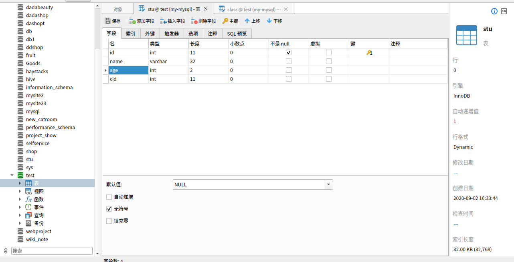
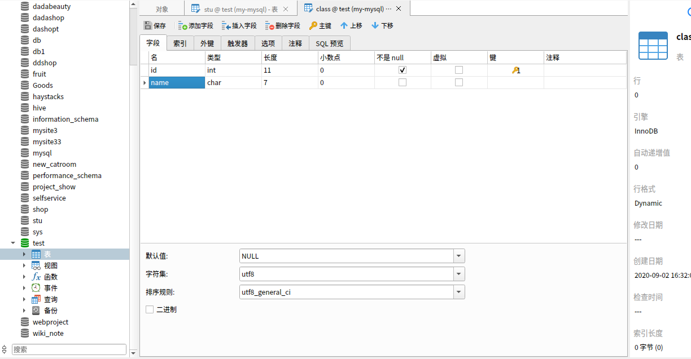
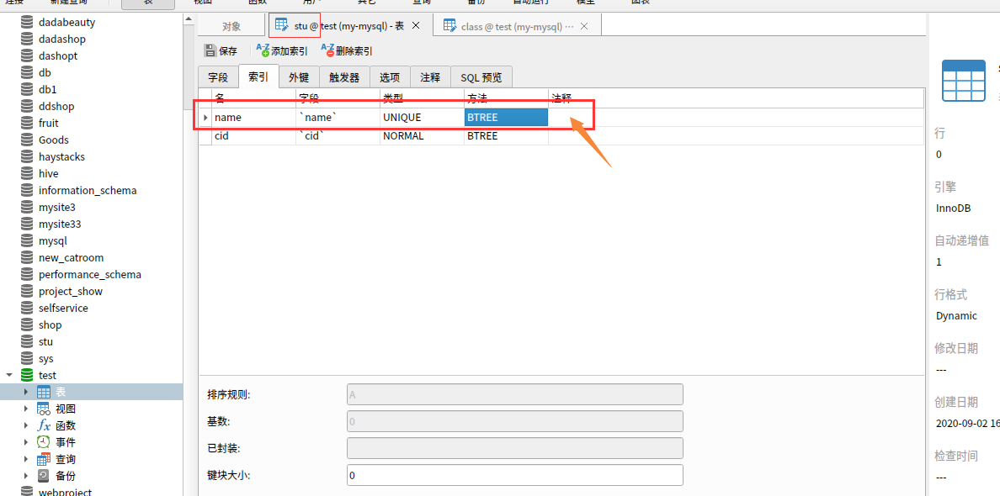
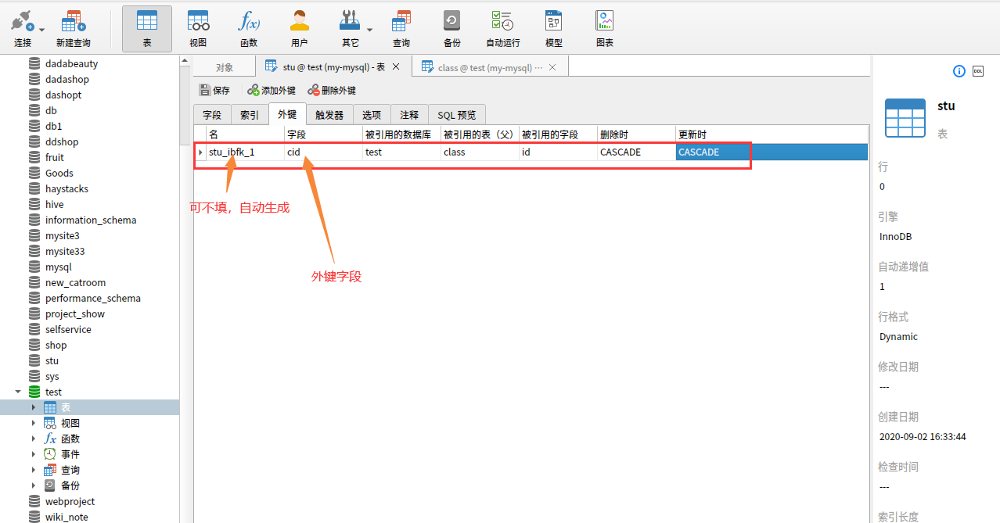
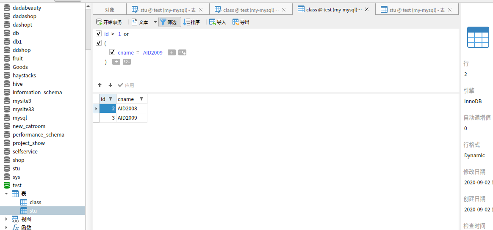
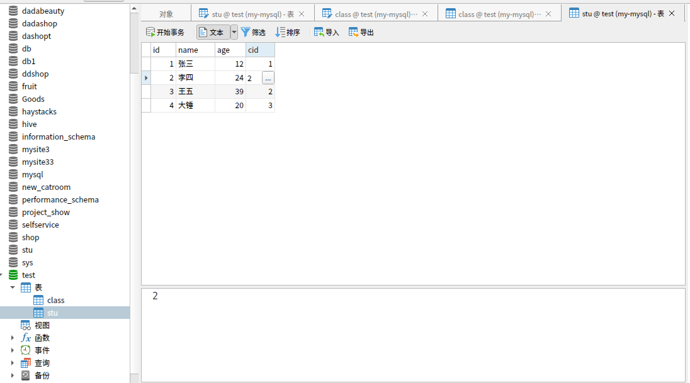

# Navicat for mysql使用

## 准备工作

1. [官网](http://www.navicat.com.cn/products)下载不同操作系统的Navicat

2. 选择试用即可

3. linux版本下执行：

   1. ```shell
      chmod +x navicat15-mysql-cs.AppImage
      ./navicat15-mysql-cs.AppImage
      ```

## navicat操作

- 远程数据库连接

- 创建数据库test

- 创建数据表stu、class

  **stu**

  | id(自增，主键，11) | name（32） | age（2，无符号） | cid（11） |
  | ------------------ | ---------- | ---------------- | --------- |
  | 1                  | 张三       | 12               | 1         |
  | 2                  | 李四       | 24               | 2         |
  | 3                  | 王五       | 39               | 2         |
  | 4                  | 大锤       | 20               | 3         |

  **class**

  | id（11，自增，主键） | name（7） |
  | -------------------- | --------- |
  | 1                    | AID2007   |
  | 2                    | AID2008   |
  | 3                    | AID2009   |

- 增删改查字段

  

  

- 增删改查索引

  - 索引有：
    - Normal 普通索引，
    - Unique 唯一索引（表示唯一的，不允许重复的索引，不为空）
    - Full Text 全文索引（检索长文本），SPATIAL 空间索引（MYSQL中的空间数据类型有4种，分别是GEOMETRY、POINT、LINESTRING、POLYGON。MYSQL使用SPATIAL关键字进行扩展，使得能够用于创建正规索引类型的语法创建空间索引。创建空间索引的列，必须将其声明为NOT NULL，空间索引只能在存储引擎为MYISAM的表中创建）
    - btree索引和hash索引

  

- 增删改查外键

  

- 添加字段值（先添加class，再添加stu）

  

  

- 级联查询语句

  ```mysql
  select * from stu,class where stu.cid=class.id;
  # 只要名字对应的班级
  select stu.name,class.name from stu,class where stu.cid=class.id;
  # 由于名字一样所以需要改名字不同进行查询
  select sname,cname from stu,class where stu.cid=class.id;
  ```

- 筛选操作

- 导出操作